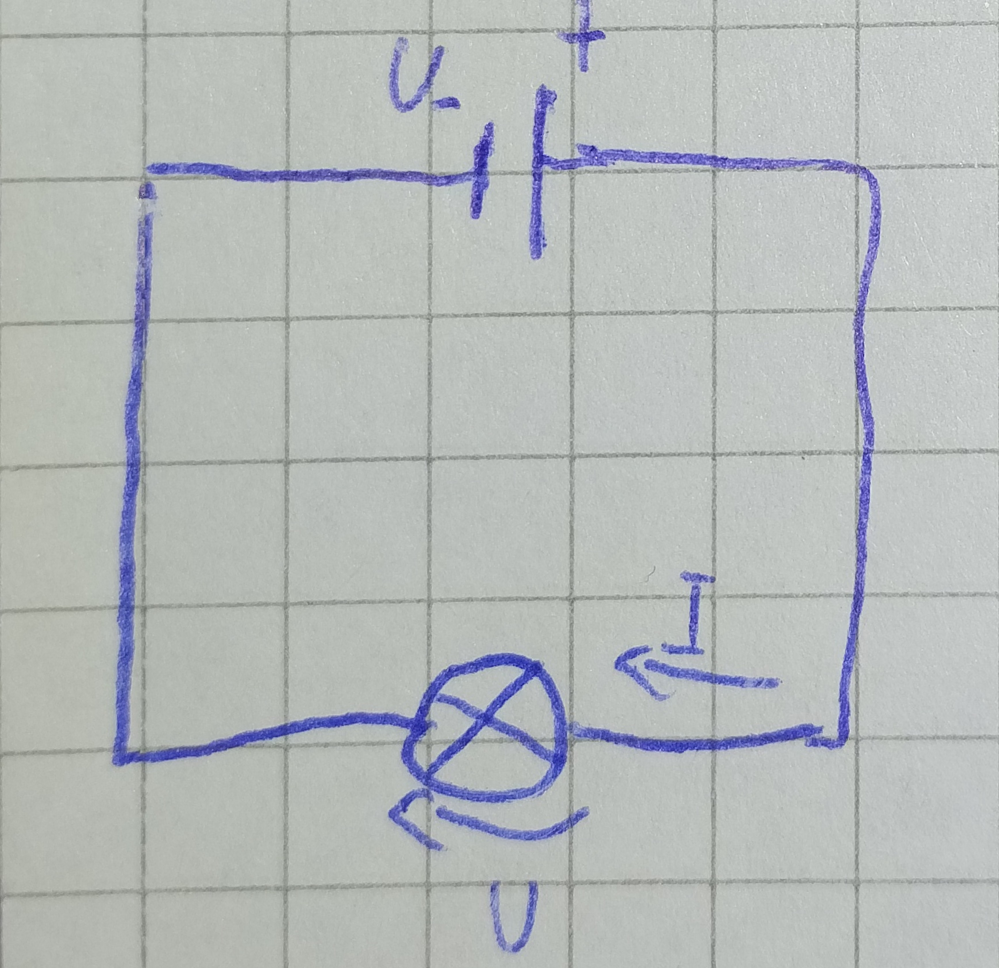
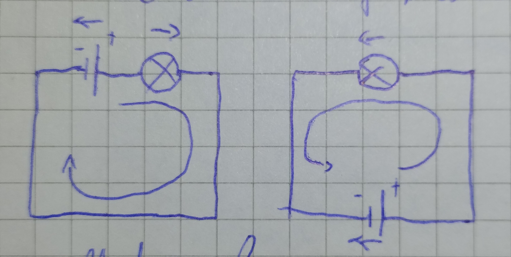
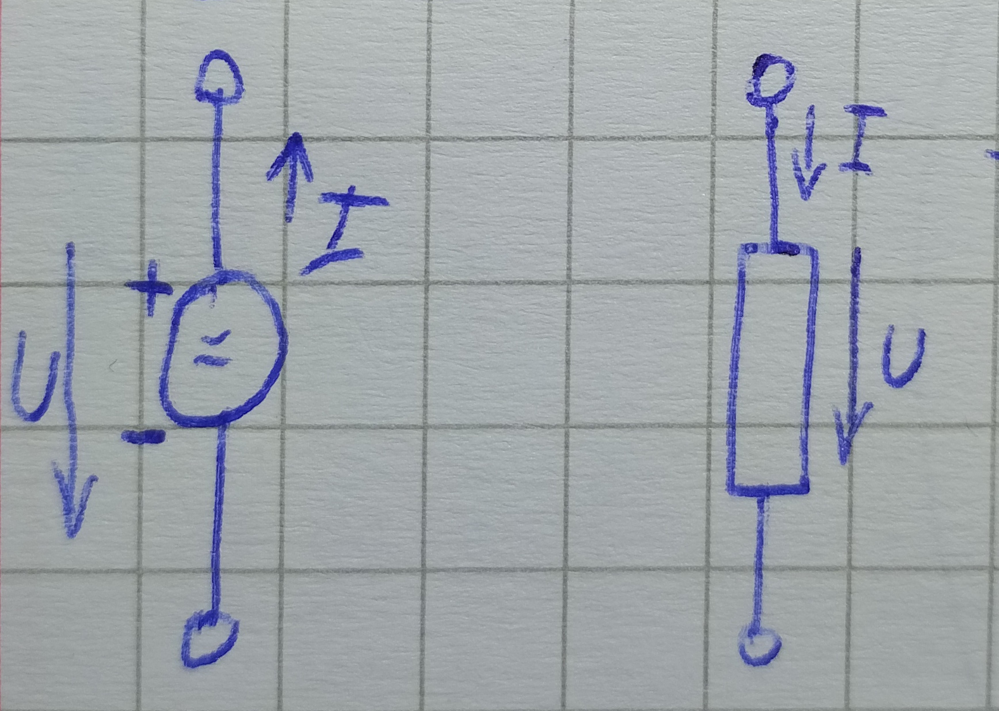

# 01 - Úvod

[Literatúra - elektrokniha.cz](https://elektrokniha.cz)

$W = U * Q \Rightarrow W = U * I * t [J]$

$W$ - práca, $Q$ - náboj

- **Zdroj** - vytvára rozdiel potenciálu = _napätie_, to uvádza do pohybu nabité častice - _prúd_
- **Spotrebič** - odoberá energiu častíc (prúdu) tým, že ich pohybu kladie _odpor_

## 3 základné zákony

- **Ohmov zákon** - závislosť medzi $U$ a $I$ na ktoromkoľvek úseku obvodu (medzi dvoma bodmi)

  - Zápis:

    - $R = \frac{U}{I} \text{ , } [\Omega]$

    - $I = \frac{U}{R} \text{ , } [A]$
    - $U = R * I \text{ , } [V]$

  - **Uzol** - miesto, kde sa stretáva viac vodičov
  - **Vetva** - dráha medzi uzlami
  - **Smyčka** - uzavretá dráha tvorená vetvami

- **Prvý Kirchhoffov zákon** - súčet všetkých prúdov v _uzle_ sa rovná nule
  - koľko náboja do uzla pritečie, toľko odtečie (v uzle náboj nevzniká ani nezaniká)
  - vetvou vždy tečie jeden prúd
- **Druhý Kirchhoffov zákon** - súčet všetkých napätí v _smyčke_ sa rovná nule
  - aké napätie je do smyčky dodávané, také z nej výde von

# 02 - Výpočty v jednosmerných obvodoch

## Čítacie šípky

- _Zdrojové_ čítacie šípky sú _nesúhlasne_ orientované
- _Spotrebičové_ čítacie sípky sú _súhlasne_ orientované

## Zapojenie zdrojov napätia

**Sériové** - sčitovanie napätia

- používame [_Druhý Kirchhoffov zákon_](https://github.com/teimo16/vut/blob/main/01sem/iel/poznamky.md?plain=1#L30)

# 03 - Meranie

## Meranie napätia

- Voltmeter sa pripája paralelne k vetvi (prvku), na ktorej chceme zmerať napätie
  - Voltmeter poznáme analógový (ručičkový) a digitálny (číslicový)

**Vnútorný odpor voltmetra**

- Mal by byť čo **najväčší**, aby čo najmenej ovplyvnil meraný obvod
- Z pohľadu obvodu je voltmeter ďaľšia vetva zapojená medzi dvoma uzlami, vetva voltmetra teda odobere z obvodu časť prúdu

[obr-01]

**Zmena rozsahu voltmetra** - pomocou _predradníkov_ (predradných odporov v sérii s voltmetrom) a zmenou vstupných svoriek alebo prepínačom

- Číslicové voltmetre majú obvody CMOS, majú teda veľmi vysoký vstupný odpor. Je lepšie použiť delič napätia alebo samotný predradník

### Meranie striedavého napätia

- Meraná je buď stredná hodnota (avg), alebo efektívna hodnota (RMS)

## Meranie prúdu

- Ampérmeter sa pripája do série k prvkom

**Vnútorný odpor ampérmetra**

- Mal by byť čo najmenší, aby čo najmenej ovplyvnil meraný obvod
- Z pohľadu obvodu je ampérmeter ďalší prvok vo vetve, ktorý kladie odpor

[obr-02]

**Zmena rozsahu ampérmetra** - pomocou _bočníkov_ (odpor paralelne s ampérmetrom) a zmenou vstupných svoriek alebo prepínačom

---

**Voľba rozsahu voltmetra a ampérmetra** - vhodné začať u najväčšieho rozsahu a postupne znižovať, dokým

- ručička nie je v druhej polovici (ideálne v poslednej tretine) stupnice
- je zaplnených čo najviac miest na digitálnom

## Meranie odporov

- **Ohmova** metóda - zmeriame $U$ a $I$ a pomocou Ohmovho zákona vypočítame $R = U / I$
- **Priama** metóda - ohmmeter

## Osciloskop

- Prístroj na pozorovanie kmitov (oscilácií)
- zobrazuje napätie
  - **v závislosti na čase**
  - v závislosti na inom napätí
- **Princíp**:
  - na obrazovke sa kreslí čiara. Pohyb zľava doprava je zpravidla plynulý (plynutie času), vychýlenie nahor či nadol je ovplyvnené okamžitou hodnotou napätia
