# 01 - Úvod

[Literatúra - elektrokniha.cz](https://elektrokniha.cz)

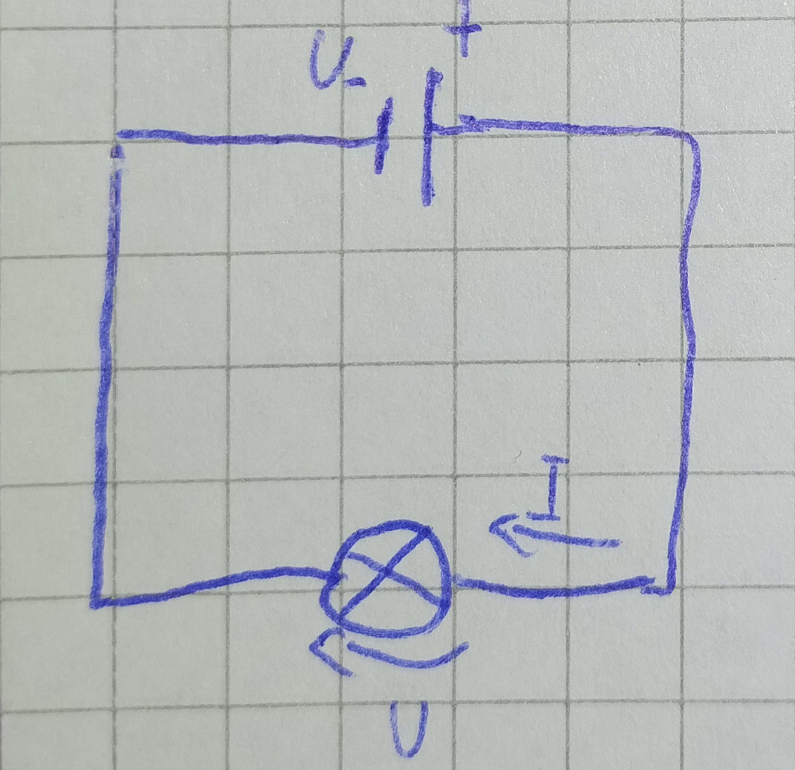

$W = U * Q \Rightarrow W = U * I * t [J]$

$W$ - práca, $Q$ - náboj

- **Zdroj** - vytvára rozdiel potenciálu = _napätie_, to uvádza do pohybu nabité častice - _prúd_
- **Spotrebič** - odoberá energiu častíc (prúdu) tým, že ich pohybu kladie _odpor_

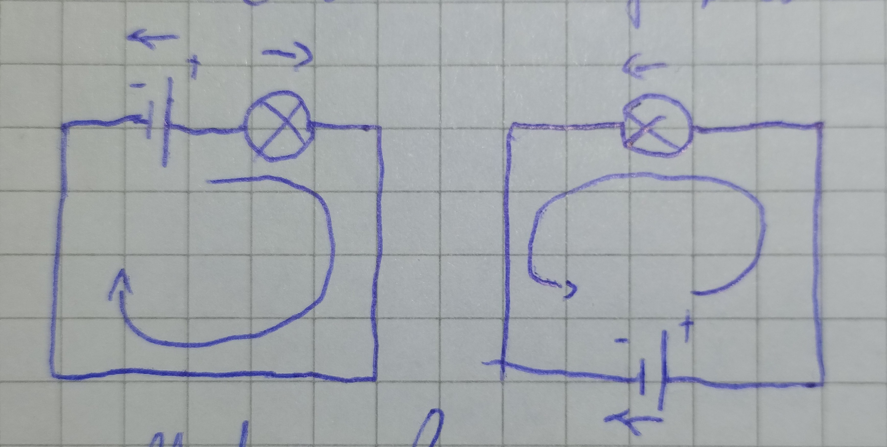

## 3 základné zákony

- **Ohmov zákon** - závislosť medzi $U$ a $I$ na ktoromkoľvek úseku obvodu (medzi dvoma bodmi)

  - Zápis:

    - $R = \frac{U}{I} \text{ , } [\Omega]$

    - $I = \frac{U}{R} \text{ , } [A]$
    - $U = R * I \text{ , } [V]$

  - **Uzol** - miesto, kde sa stretáva viac vodičov
  - **Vetva** - dráha medzi uzlami
  - **Smyčka** - uzavretá dráha tvorená vetvami

- **Prvý Kirchhoffov zákon** - súčet všetkých prúdov v _uzle_ sa rovná nule
  - koľko náboja do uzla pritečie, toľko odtečie (v uzle náboj nevzniká ani nezaniká)
  - vetvou vždy tečie jeden prúd
- **Druhý Kirchhoffov zákon** - súčet všetkých napätí v _smyčke_ sa rovná nule
  - aké napätie je do smyčky dodávané, také z nej výde von

# 02 - Výpočty v jednosmerných obvodoch

## Čítacie šípky

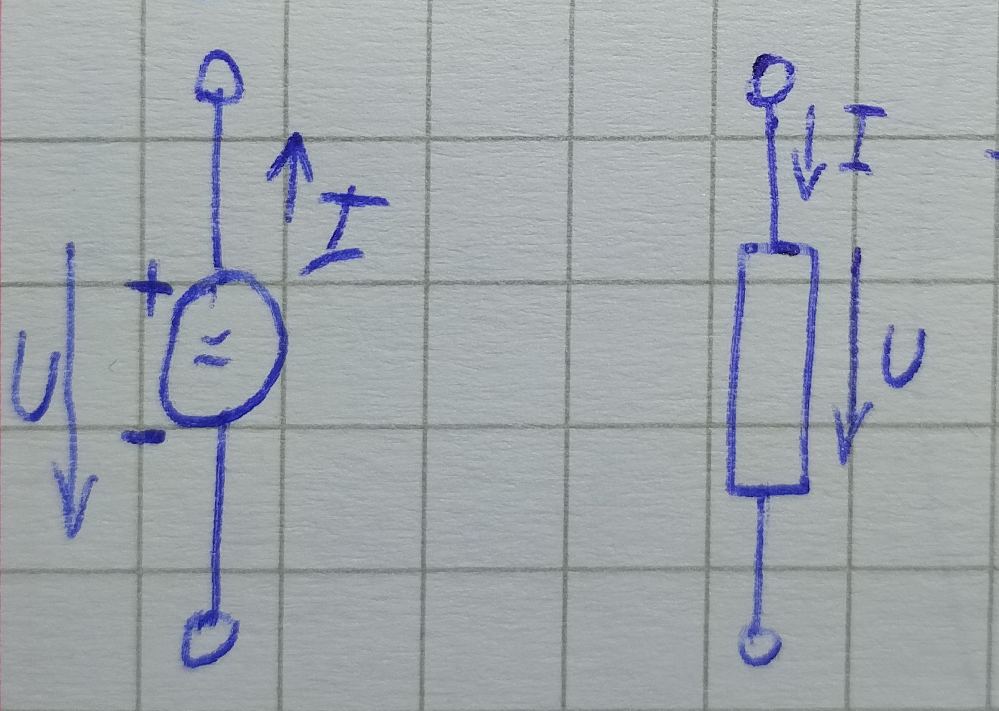

- _Zdrojové_ čítacie šípky sú _nesúhlasne_ orientované
- _Spotrebičové_ čítacie sípky sú _súhlasne_ orientované

## Zapojenie zdrojov napätia

**Sériové** - sčitovanie napätia

- používame [_Druhý_](https://github.com/teimo16/vut/blob/main/01sem/iel/poznamky.md#3-z%C3%A1kladn%C3%A9-z%C3%A1kony) _Kirchhoffov zákon_
  - $U_{1} + U_{2} - U_{V} = 0$
  - $U_{V} = U_{1} + U_{2}$

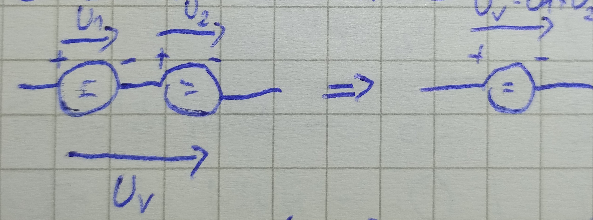

**Paralelné** - sčitovanie prúdu

- používame [_Prvý_](https://github.com/teimo16/vut/blob/main/01sem/iel/poznamky.md#3-z%C3%A1kladn%C3%A9-z%C3%A1kony) _Kirchhoffov zákon_
  - $I_{1} + I_{2} - I = 0$
  - $I = I_{1} + I_{2}$

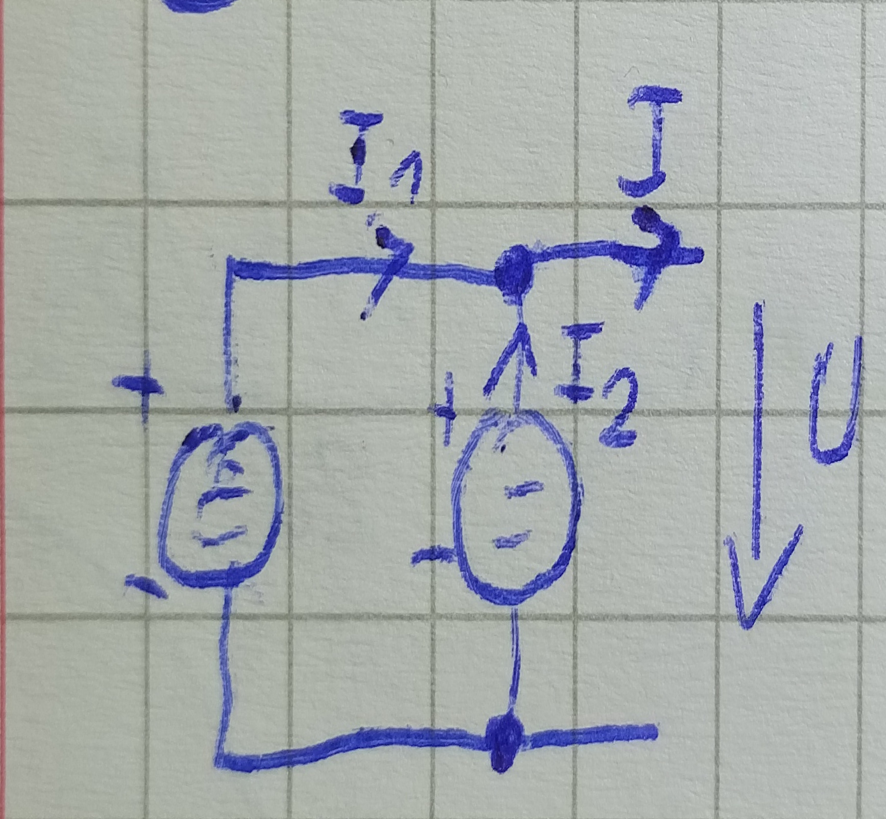

## Jednoduchý obvod s jedným napájacím zdrojom jednosmerného prúdu

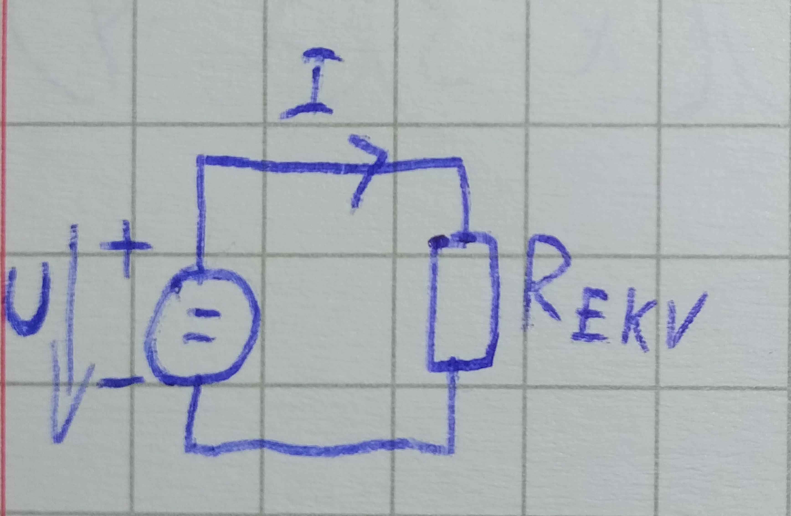

$I = \frac{U}{R_{EKV}}$

### Sériové odpory

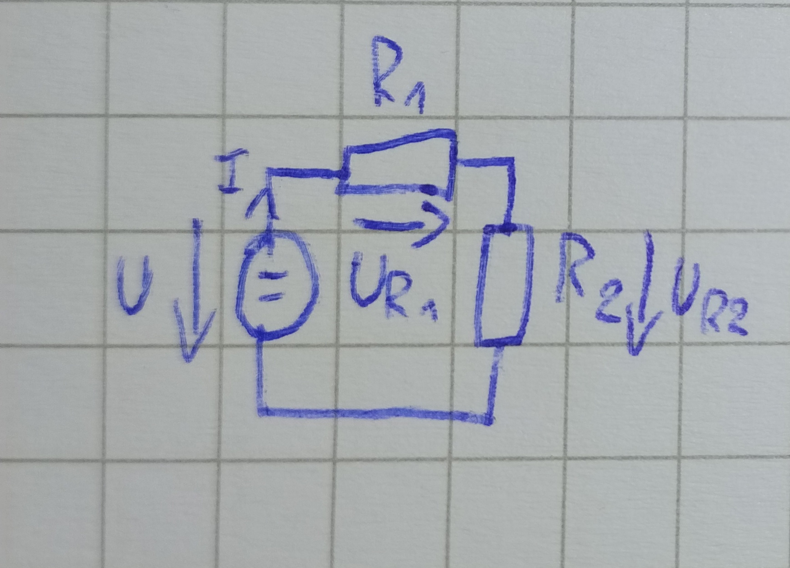

$U_{R_{1}} = R_{1} * I$

$U_{R_{2}} = R_{2} * I$ - rovnaký $I$

---

$I = \frac{U}{R_{EKV}}$

$U = U_{R_{1}} + U_{R_{2}}$ (II.KZ)

$R_{EKV} = R_1 + R_2$

$\Rightarrow$

$I = \frac{U_{R_{1}}}{R_1} = \frac{U_{R_{2}}}{R_2}$

$\frac{U_{R_{1}}}{U_{R_{2}}} = \frac{R_1}{R_2}$ -- pomer $U$ na $R$

- Výsledný $R_{EKV}$ sériového zapojenia odporov je väčší než ktorýkoľvek z odporov v obvode $R_{EKV} = R_1 + R_2$

_Delič napätia_

$\frac{U_{R_{1}}}{U_{R_{2}}} = \frac{(U - U_{R_{2}})}{U_{R_{2}}} = \frac{R_1}{R_2}$

...

### Paralelné odpory

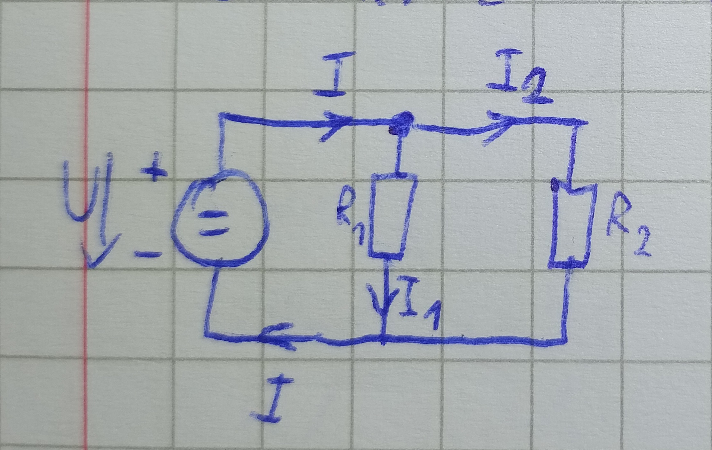

$\frac{1}{R} = \frac{1}{R_1} + \frac{1}{R_2}$

$R = \frac{R_1 * R_2}{R_1 + R_2}$

$U = U_{R_1} = U_{R_2}$

- Paralelné spojenie odporov je menšie ako ktorékoľvek z odporov v obvode

## Metóda zjednodušovania - Trojuhoľník -> Hviezda

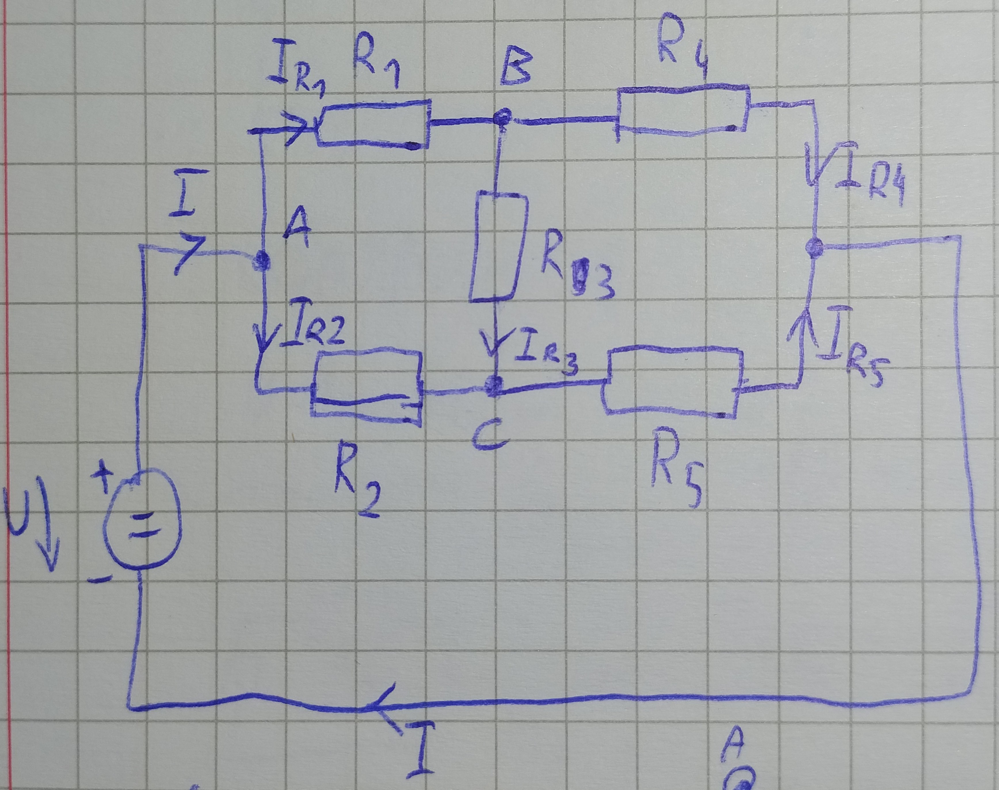

$\rightarrow$ zjednodušíme na trojuhoľník a z trojuhoľníka na hviezdu, ktorú dosadíme do pôvodného obvodu $\rightarrow$

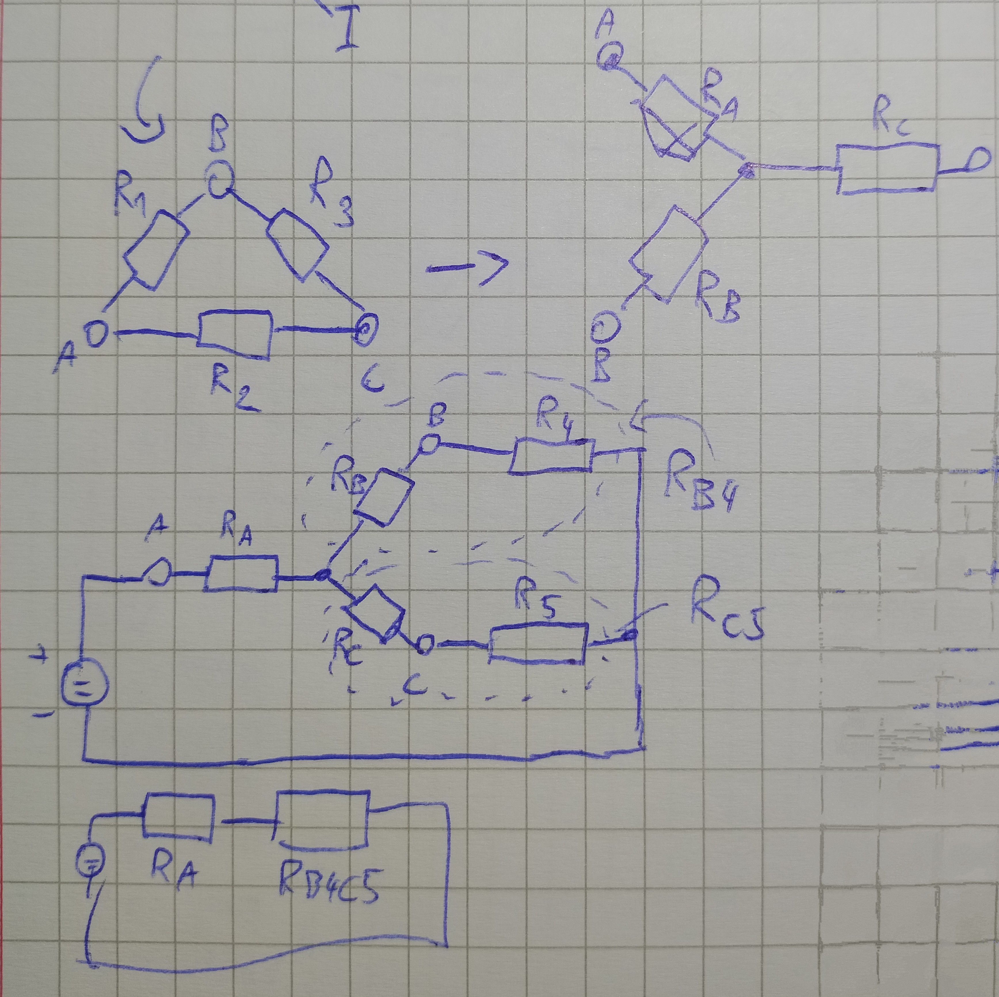

<ins>**Sériové odpory**</ins>

$R_{B4} = R_B + R_4$

$R_{C5} = R_C + R_5$

<ins>**Paralelné odpory**</ins>

$R_{B4C5} = \frac{R_{B4} * R_{C5}}{R_{B4} + R_{C5}}$

---

$R_{EKV} = R_A + R_{B4C5}$

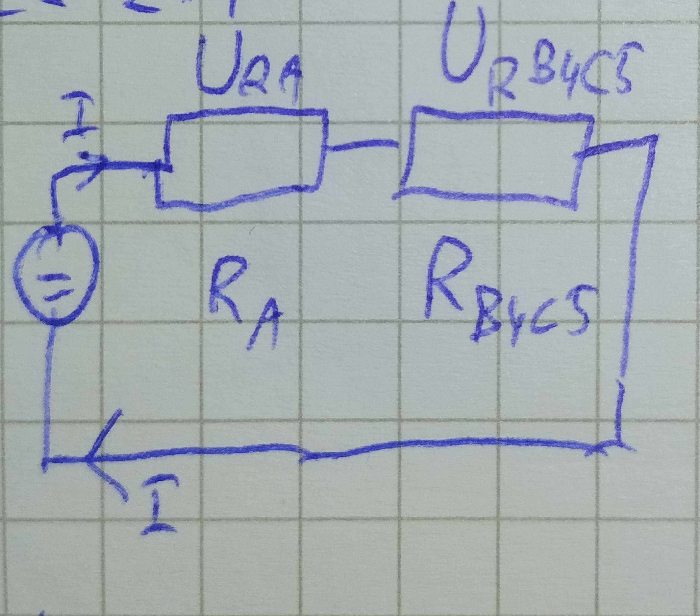

$U_{R_A} = R_A * I$

$U_{R_{B4C5}} = R_{B4C5} * I$

_Kontrola II.KZ_: $U = U_{R_A} + U_{R_{B4C5}}$

$\rightarrow$ $R_{B4C5}$ naspäť rozložíme na $R_{B4}$ a $R_{C5}$ $\rightarrow$

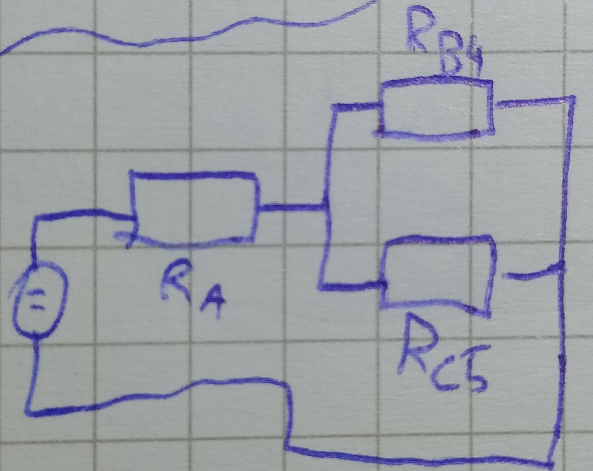

$I_{R_{B4}} = \frac{U_{R_{B4C5}}}{R_{B4}}$

$I_{R_{C5}} = \frac{U_{R_{B4C5}}}{R_{C5}}$

$I = I_{R_{B4}} + I_{R_{C5}}$ -- I.KZ

$\rightarrow$ $R_{B4}$ a $R_{C5}$ ďalej rozložíme na $R_B$, $R_4$, $R_C$ a $R_5$ $\rightarrow$

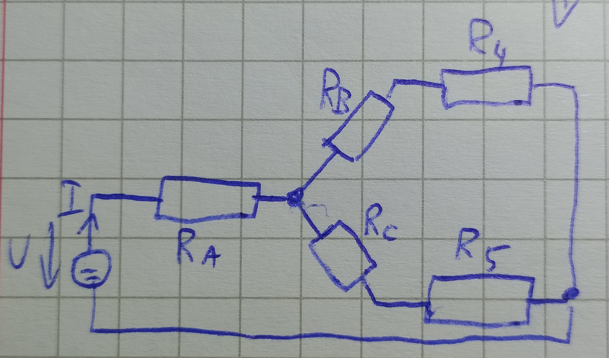

# 03 - Meranie

## Meranie napätia

- Voltmeter sa pripája paralelne k vetvi (prvku), na ktorej chceme zmerať napätie
  - Voltmeter poznáme analógový (ručičkový) a digitálny (číslicový)

**Vnútorný odpor voltmetra**

- Mal by byť čo **najväčší**, aby čo najmenej ovplyvnil meraný obvod
- Z pohľadu obvodu je voltmeter ďaľšia vetva zapojená medzi dvoma uzlami, vetva voltmetra teda odobere z obvodu časť prúdu

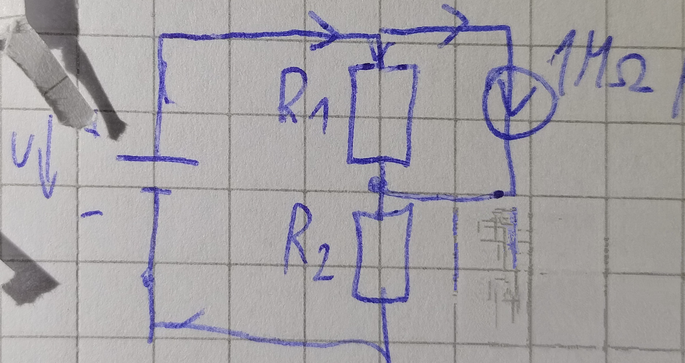

$R_V = 1M\Omega$

$R_1 = 100k\Omega$

$R_1$ má po zapojení voltmetra efektívny odpor iba $90,9k\Omega$

**Zmena rozsahu voltmetra** - pomocou _predradníkov_ (predradných odporov v sérii s voltmetrom) a zmenou vstupných svoriek alebo prepínačom

- Číslicové voltmetre majú obvody CMOS, majú teda veľmi vysoký vstupný odpor. Je lepšie použiť delič napätia alebo samotný predradník

### Meranie striedavého napätia

- Meraná je buď stredná hodnota (avg), alebo efektívna hodnota (RMS)

## Meranie prúdu

- Ampérmeter sa pripája do série k prvkom

**Vnútorný odpor ampérmetra**

- Mal by byť čo najmenší, aby čo najmenej ovplyvnil meraný obvod
- Z pohľadu obvodu je ampérmeter ďalší prvok vo vetve, ktorý kladie odpor

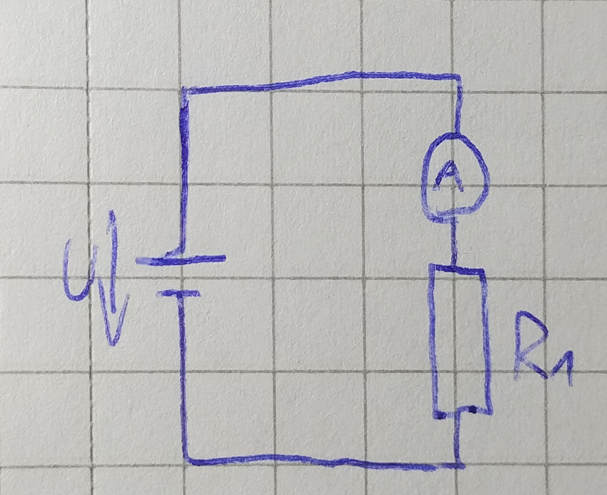

$R_A = 5\Omega$

$R_1 = 100\Omega$

$R = 105\Omega$

**Zmena rozsahu ampérmetra** - pomocou _bočníkov_ (odpor paralelne s ampérmetrom) a zmenou vstupných svoriek alebo prepínačom

---

**Voľba rozsahu voltmetra a ampérmetra** - vhodné začať u najväčšieho rozsahu a postupne znižovať, dokým

- ručička nie je v druhej polovici (ideálne v poslednej tretine) stupnice
- je zaplnených čo najviac miest na digitálnom

## Meranie odporov

- **Ohmova** metóda - zmeriame $U$ a $I$ a pomocou Ohmovho zákona vypočítame $R = U / I$
- **Priama** metóda - ohmmeter

## Osciloskop

- Prístroj na pozorovanie kmitov (oscilácií)
- zobrazuje napätie
  - **v závislosti na čase**
  - v závislosti na inom napätí
- **Princíp**:
  - na obrazovke sa kreslí čiara. Pohyb zľava doprava je zpravidla plynulý (plynutie času), vychýlenie nahor či nadol je ovplyvnené okamžitou hodnotou napätia

# 04 - Riešenie obvodov pomocou SLAR

## Riešenie obvodu pomocou Kirchhoffových zákonov

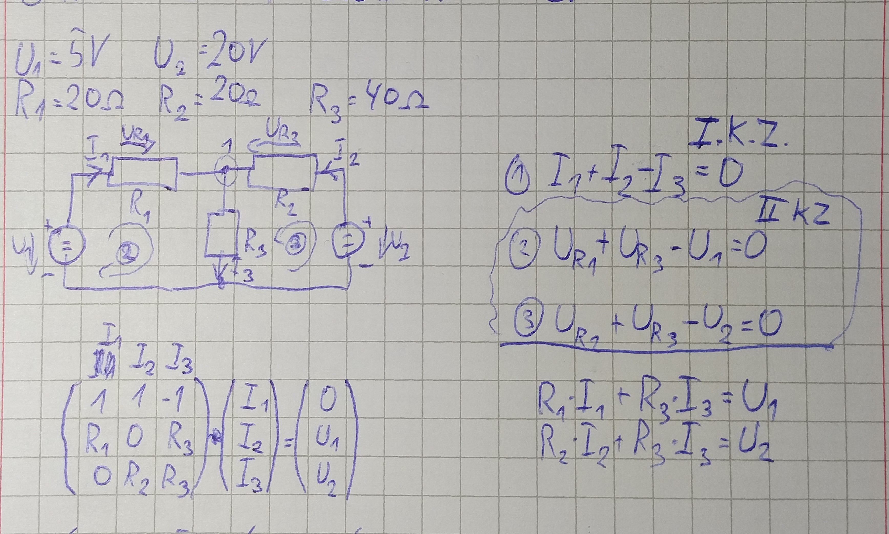

### Metóda smyčkových prúdov

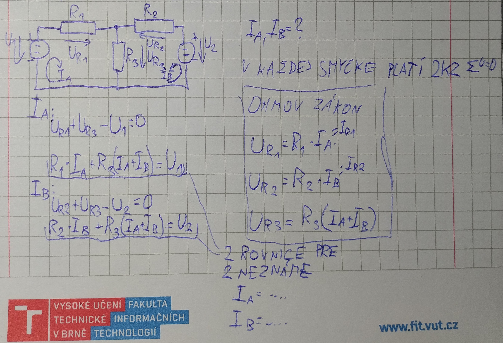

Výpočet prúdov $I_{R_1}$, $I_{R_2}$, $I_{R_3}$

- Poznáme $I_A$, $I_B$

- Podľa zvolenej orientácie priradíme ostatné prúdy:

  $I_{R_1} = I_A$

  $I_{R_2} = I_B$

  $I_{R_3} = I_A + I_B$

- Dopočítame $U_{R_1}$, $U_{R_2}$, $U_{R_3}$:

  $U_{R_1} = {R_1} * I_{R_1}$

  $U_{R_2} = {R_2} * I_{R_2}$

  $U_{R_3} = {R_3} * I_{R_3}$

### Metóda uzlových napätí

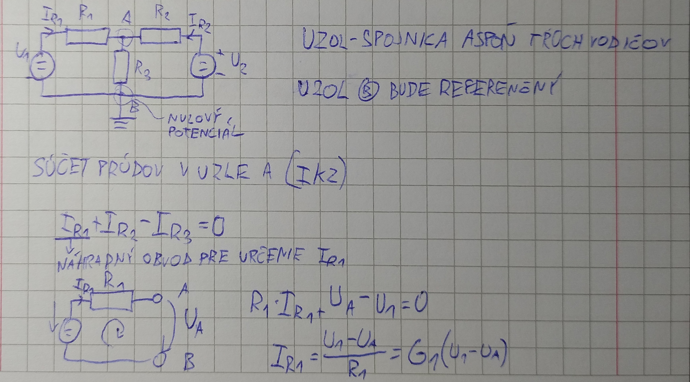
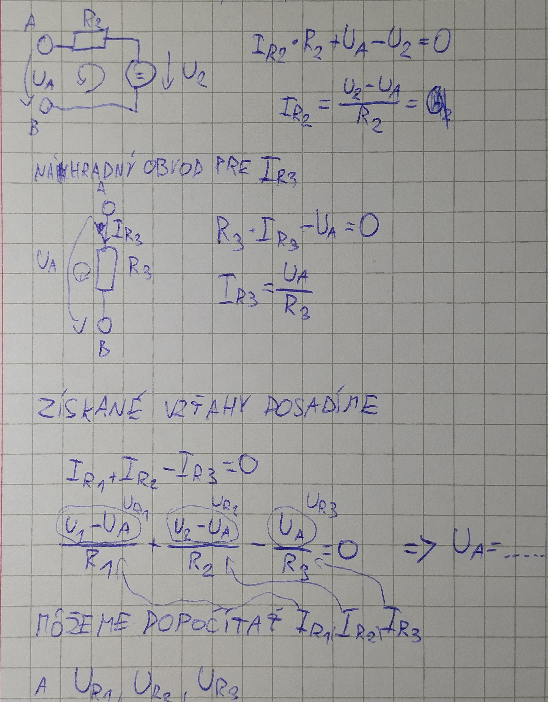
